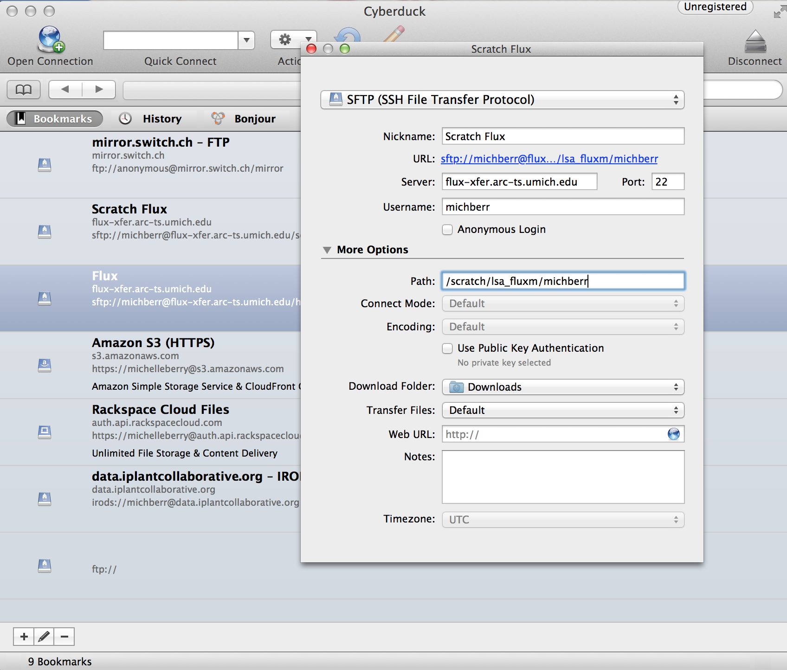
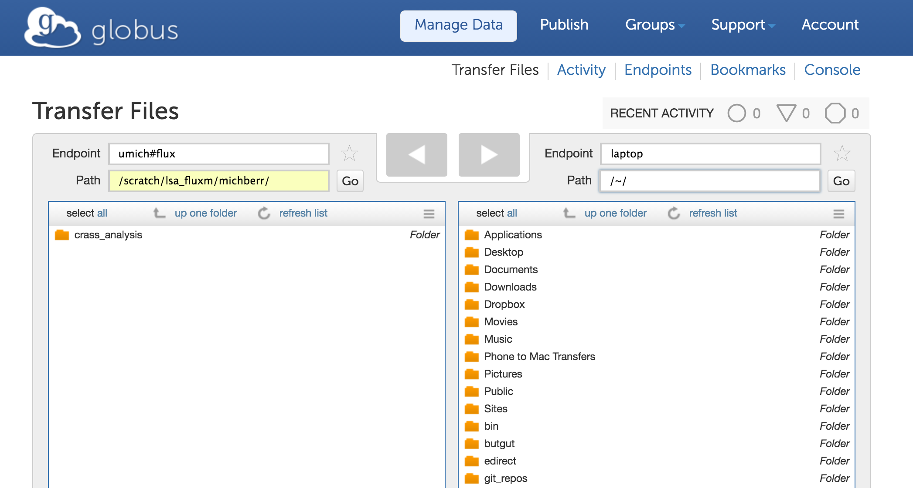

------------

> ## Objectives
>
> * Explain the steps involved in obtaining a flux account
> * Provide links to supplementary software that makes interacting with flux easier

------------

# Getting a flux account

Arc-ts describes how to set up a flux account [here](http://arc-ts.umich.edu/flux-user-guide/). Follow steps 1-4 before moving onto any other lesson.

**Note:** I recommend the software mtoken. Then you don't have to keep track of it!

------------

There are some other software programs that will make your life much easier 
while working with flux.

## Cyberduck

Cyberduck is a GUI program that allows you to connect to a remote server and 
transfer files between a remote server and local machine. You can essentially 
drag and drop files from your flux account onto your computer. 

**You can download Cyberduck [here](https://cyberduck.io/?l=en).**

### Configuration

You will need to configure Cyberduck to access your flux account

1) Click on the + button at the bottom left to add a new server connection to your bookmarks

2) Select SFTP (SSH File Transfer Protocol) from the drop down menu at the top

3) Enter the location of the server you are trying to connect to
  * The Server address is flux-xfer.arc-ts.umich.edu
  * The path depends on where you want to connect. I have bookmarks for my home
  directory and scratch drive, but I almost exclusively use the scratch drive which would be: /scratch/lsa_fluxm/michberr.
  
  

------------
## Globus

Globus is similar to cyberduck in that it provides a GUI for transferring 
files between machines. There are a few differences, however. 

1) Globus is *much* faster than cyberduck, so it
is ideal to use for very large files. 

2) Globus can transfer files between two remote servers. For example, you can use
Globus to transfer files between Greg's geomicro servers and your flux account.
You can also use Globus to transfer files between different locations on your 
flux account such as between the nfs and scratch drives. The only requirement for
tranferring files with Globus is that an endpoint must be set up. These have already
been configured on flux and the geomicro servers. It is not too hard to set up a 
personal endpoint on your own computer.

3) Globus is accessed through a web browser. If you are transferring files between
two remote servers, once you have submitted the transfer request, you can close your computer :) 

**You can download and register for a Globus personal endpoint [here](https://www.globus.org/globus-connect-personal).**

Once you have Globus downloaded, you can access a web page to transfer files between 
remote servers and your personal machine using aliases. For example, flux is accessible 
through the alias "umich#flux". You can set an alias for your own computer.
In the example below, it is simply called "laptop".

       

     

      
      
          
