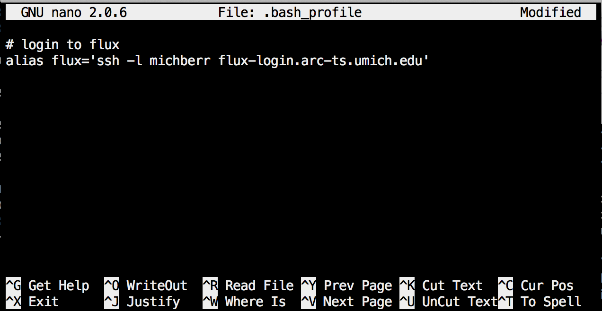

------------

> ## Objectives
>
> * Demonstrate how to log into FLUX
> * Describe how to navigate in FLUX
> * Provide some useful aliases to make login easier


------------


# Logging into FLUX
You will need to log into flux using a command-line terminal. If you have a mac machine, open your terminal program. On a PC you will need to download an external emulator program like [cygwin](https://www.cygwin.com/).

If you are logging into FLUX from off campus, you will need to set up a VPN.
Information on this is available [here](http://arc-ts.umich.edu/flux-user-guide/).


To log into FLUX, use the following command:   
```{r}
ssh -l your-uniq-name flux-login.arc-ts.umich.edu
```
FLUX will then ask for your mtoken. Paste it in and press enter. It will not appear on the screen, but it is there. Be patient, it might take a few minutes for the server to validate your token.

Next, FLUX will ask for your Password. This is your umich password. Similarly,
your password will not appear on the screen but it is there.


------------

# Navigation

Once you have logged in to FLUX, you should be in your home directory. We
can use `pwd` to check our location:

```{r}
pwd
```
    


You are currently on a "login node". This basically means we are on a dinky computer
which can't do a lot of processing, but it can allow us to do some simple tasks like
viewing files, editing files, or moving files. 

I don't keep much in my home directory. The only things I store there are a copy of
my scripts and a .bash_profile with some helpful aliases. When I want to run programs, I copy my data
and scripts to the scratch drive which is the fastest drive to run programs from. You can
access the scratch drive both from the LSA account or if your lab has its own allcoation:

```{r}
# Navigate to LSA's scratch drive
cd /scratch/lsa_fluxm/your-uniq-name

# Navigate to the Denef lab scratch drive
cd /scratch/vdenef_fluxm/your-uniq-name
```

However, you might have seen in the login message that both the home and scratch
drives are NOT for longterm data storage. In fact, FLUX will delete your files if
you leave them on the scratch drive for longer than 3 months without touching them.
They will send you a couple of warning emails beforehand, though. 

Therefore, it's best
to have another server (the Denef lab has an nfs drive) that is designed for storage.
After you run your analysis, you should get into the habit of transferring all of
your results to this alternative location and removing it from the scratch drive.


# Easier login
If you are logging into flux frequently, it can be cumbersome to type this in all the time. Therefore, i recommend you create some aliases in your bash profile. 


Navigate to your home directory:      

```{r}
# cd with no argument will take you to your home
cd

# Print working directory to make sure you're in the right place
pwd
```
    
See if you have a file called `.bash_profile`, and if not, make a file:

```{r}
# List all files in your current directory (including files starting with '.')
ls -a

# Create a .bash_profile file if it doesn't exist
touch .bash_profile

# Open your file for editing with nano
nano .bash_profile
```

Add these lines to your file (make sure to change to your uniq name!) and save.        
**Note:** The alias for the mtoken will only work for a Mac. 
If you have a PC, you will need to obtain the path to your program. 
```{r}
# login to flux
alias flux='ssh -l your-uniq-name flux-login.arc-ts.umich.edu'

# Open RSA SecurID
alias mtoken='open -a /Applications/SecurID.app'

```



Now, when you want to login to flux, you only have to type **`mtoken`** to start up your SecurID program and **`flux`** to initiate the login process!      

       
------------
     
              

