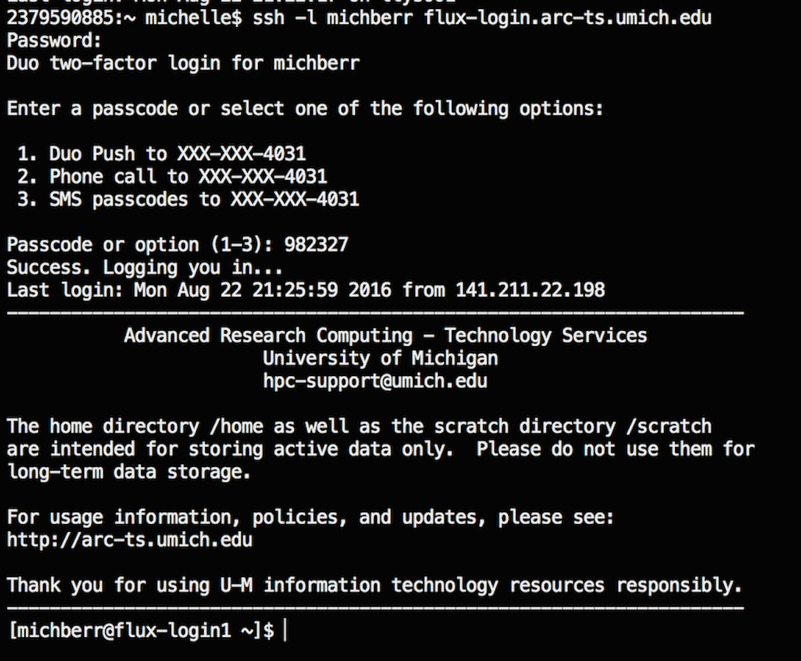

------------

> ## Objectives
>
> * Demonstrate how to log into FLUX
> * Provide some useful aliases to make login easier
> * 


------------


# Logging into FLUX
You will need to log into flux using a command-line terminal. If you have a mac machine, open your terminal program. On a PC you will need to download an external emulator program like [cygwin](https://www.cygwin.com/).

If you are logging into FLUX from off campus, you will need to set up a VPN.
Information on this is available [here]([here](http://arc-ts.umich.edu/flux-user-guide/))


To log into FLUX, use the following command:   
```{r}
ssh -l your-uniq-name flux-login.arc-ts.umich.edu
```
FLUX will then ask for your mtoken. Paste it in and press enter. It will not appear on the screen, but it is there. Be patient, it might take a few minutes for the server to validate your token.

Next, FLUX will ask for your Password. This is your umich password. Similarly,
your password will not appear on the screen but it is there.



# Easier login
If you are logging into flux frequently, it can be cumbersome to type this in all the time. Therefore, i recommend you create some aliases in your bash profile. 


Navigate to your home directory      

```{r}
# cd with no argument will take you to your home
cd

# Print working directory to make sure you're in the right place
pwd
```
    
See if you have a file called `.bash_profile`. If not, make a file.

```{r}
# List all files in your current directory (including files starting with '.')
ls -a

# Create a .bash_profile file if it doesn't exist
touch .bash_profile

# Open your file for editing with nano
nano .bash_profile
```

Add these lines to your file and save. **Note:** The alias for the mtoken will
only work for a Mac. If you have a PC, you will need to obtain the path to your program. 
```{r}
# login to flux
alias flux='ssh -l michberr flux-login.arc-ts.umich.edu'

# Open RSA SecurID
alias mtoken='open -a /Applications/SecurID.app'

```

Now, when you want to login to flux, you only have to type `mtoken` to start up your SecurID program and `flux` to initiate the login process!

