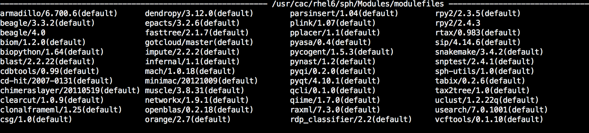
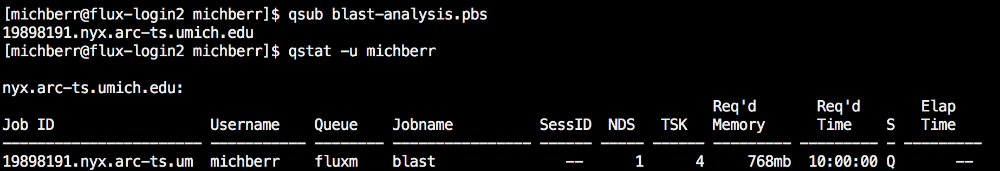
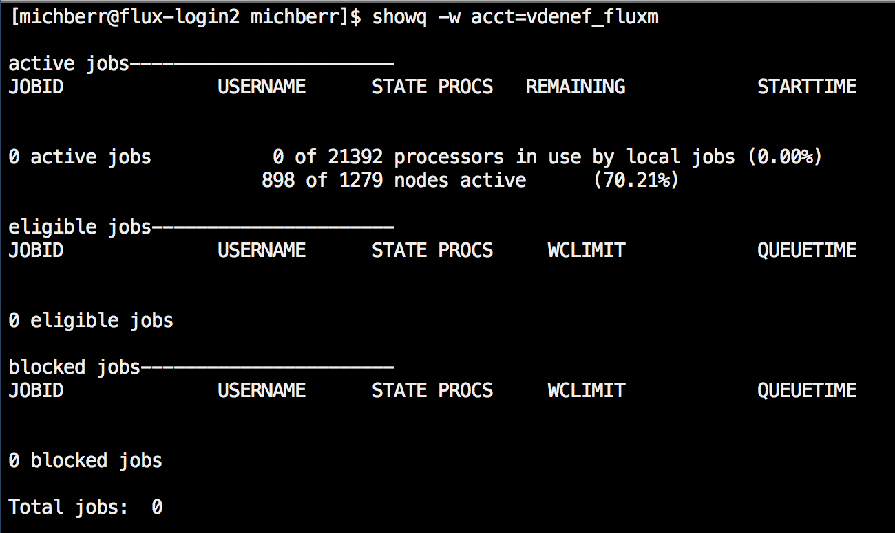
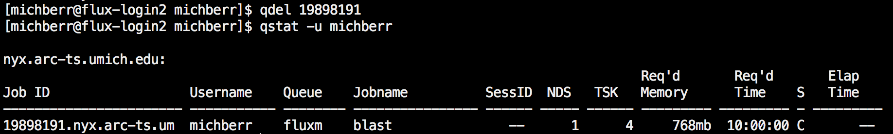

------------

> ## Objectives
>
> * Introduce PBS and describe the arguments of a PBS script
> * Explain how to execute, view, and cancel jobs on FLUX
> * Discuss memory and walltime considerations


------------

# Jobs

To execute programs on FLUX, you will submit them to a job scheduling software called **PBS**, which stands for **Portable Batch System**. The role of **PBS** is to allocate computational resources (e.g., nodes, processors, and time) among the scheduled tasks.           
   
This means that every time you want to run a program on FLUX, you will need a **PBS** script, ending in .pbs, that describes what resources are required for the program.
       
------------

## PBS scripts

#### Below is an example of a PBS script, blast-analysis.pbs, used to run a BLAST program: 
To help distinguish code chunks that pertain to a pbs script from code chunks 
that should be typed in the terminal,
chunks from scripts will have white backgrounds and chunks with terminal commands
will have grey backgrounds. 

```{}
####  PBS preamble
#PBS -N blast
#PBS -M michberr@umich.edu

#PBS -l nodes=1:ppn=4, mem=100gb, walltime=10:00:00
#PBS -V

#PBS -A vdenef_fluxm
#PBS -l qos=flux
#PBS -q fluxm

#PBS -m bea
#PBS -j oe

####  End PBS preamble

#  Show list of CPUs you ran on, if you're running under PBS
if [ -n "$PBS_NODEFILE" ]; then cat $PBS_NODEFILE; fi

#  Change to the directory you submitted from
if [ -n "$PBS_O_WORKDIR" ]; then cd $PBS_O_WORKDIR; fi
pwd

## Job commands
# must load module med/ncbi-blast

bash ./blast-analysis.sh


```

The first thing you might notice about this script is that the
first several lines start with **`#PBS`**. Normally, a **`#`** indicates a comment, i.e. a command that will *not* be read by a computer program. However, in this case, a line starting with **`#PBS`** indicates that it is a line that should be read by the PBS software.
Lines that begin with a `#` without `PBS` directly following it are interpreted as comments by bash. 

#### Now, we will walk through each line of the script one at a time.    

This first line takes an argument `-N`, which assigns a name to the job. Pick something
descriptive but short - only the first 8 characters will be used. In this example
my job is simply named "blast".

```{}
#PBS -N blast
```

This line indicates which email you want notifications sent to. By default notifications will be sent to your umich address. 
```{}
#PBS -M michberr@umich.edu
```

This next line indicates how many nodes, processors per nodes,
and walltime to allocate. The Denef lab has two types of flux nodes:         
    
&nbsp;&nbsp;&nbsp;&nbsp; 1) Our regular flux nodes (flux) have 20 processors, 4gb per processor.          

&nbsp;&nbsp;&nbsp;&nbsp; 2) Our high memory nodes (fluxm) have 40 processors, 25gb per processor.          

If you are not using the Denef lab account, check on what sort of resources
you have available. Info on the LSA public account is available [here](http://arc-ts.umich.edu/flux-configuration/). 

The line below indicates we want to allocate 1 node with 4 processors, 100gb of memory, and 10 hours for the analysis. 
You can tell from the memory requirements (100gb/ 4 processors) that this job will be run on a fluxm node.

```{}
#PBS -l nodes=1:ppn=4,mem=100gb,walltime=10:00:00
```

This next line is like magic. It transfers everything in your
current environment into the environment of the node your job
will be run on. This will become important later when we load modules

```{}
#PBS -V
```

These two lines describe how your job is paid for and which set of resources to run against. `-A` indicates the account. In the example below, the job is going to be run on the Denef lab's fluxm account. If I wanted to run it on the flux (low memory) account, I would use `-A vdenef_flux`. The `-q` line indicates which queue your job should go into. This should always match the option for `-A` (i.e. flux or fluxm).

```{}
#PBS -A vdenef_fluxm
#PBS -q fluxm
```

The line should never change. 
```{}
#PBS -l qos=flux
```

This line describes when you want to get email notifications about your job. If you input all options, bea, you will get messages when the job **b**egins, when an **e**rror occurs, and **a**fter the job has completed. Depending on the type of job, you might find all of the messages in your email annoying. I usually just leave an `e` or `ea` on this line. 

```{}
#PBS -m bea
```

This line joins the output and error messages into one document rather than 
outputting a separate file for each. This isn't necessary, but it helps to declutter your job output files. 
```{}
#PBS -j oe
```

Whew, we've gotten to the end of our `PBS` commands! These next two lines
are useful output from your job to show how many CPUs the job ran on and which directory it was running from. A PBS job has certain default variables stored like `$PBS_O_WORKDIR` which is the output working directory. 

```{}
#  Show list of CPUs you ran on, if you're running under PBS
if [ -n "$PBS_NODEFILE" ]; then cat $PBS_NODEFILE; fi

#  Change to the directory you submitted from
if [ -n "$PBS_O_WORKDIR" ]; then cd $PBS_O_WORKDIR; fi
pwd
```
Finally, this last section actually executes our program. In this case we are executing a shell script called blast-analysis.sh that presumably calls one of the BLAST commands. We also wrote a comment to ourselves reminding us
which **modules** need to be loaded before running the job. 

```{}
## Job commands
# must load module med/ncbi-blast

bash ./blast-analysis.sh

```
## Loading modules

If your job requires any external software such as BLAST, mothur, tophat, etc,
you will need to load these modules before executing your job. Modules are available
in different locations. I usually check for bioinformatics modules in med, sph, and lsa. 

Typing the following command into the terminal will allow you to view all of the modules available from
the school of public health:
```{r}
module load sph
module av
```

    

You will notice that there are often multiple versions of a software available. 
If you do not specify which version to load, the default version will be selected.    

To load the BLAST module (default is 2.2.29) :
```{r}
module load med
module load ncbi-blast 

```


**IMPORTANT: **
You can technically load modules from within your pbs script, but this is not
recommended. Instead, you should load a module from the command line before you
submit your job. This is where the `#PBS -V` option comes in handy! Whatever
modules you load in your local environment will be present in the processing environment. 

------------

## Starting a job


You can start your job with this simple line:
```{r}
qsub your-pbs-file.pbs
```

Always make sure that you have loaded your modules before hand!

------------

## Viewing a job

Once you have submitted your job, you can check on it in a few ways.   

To view the status of your job, use the `qstat` command.
   

```{r}
qstat -u your-uniqname

```

Each job is assigned a unique job id, which is viewable on the left. 
On the right, there is a column S for status where you can see whether your job is in the queue (Q), running (R), or completed (C).

In this example, I have just submitted a job, so it is waiting in the queue:





------------

To peek at the output of a job as it is running, you can use the `qpeek` command with the job id
```{r}
qpeek job-id
```
To view all the jobs running on an account, your can use the `showq` command.
This is often useful to do before running a job to determine how long your job
will be in the queue before it can run.

```{r}
showq -w acct=your-account

```

------------

## Cancelling a job

You can cancel a job in the queue or a running job using `qdel` with the job id. 
```{r}
qdel job-id
```



Notice that the right column now displays a "C" for complete. The job didn't actually
run because we cancelled it before it started. Therefore a "C" just means the job
is no longer running or waiting to run. It tells you nothing about the success of the job. 


------------

# Considerations

When you start out it's hard to know how many resources to allocate to a job. In
general you want to overestimate your resources, because if you run out of memory 
or time, your job will fail and you will have to start over. This sucks if you have
been running something for 3 days and you only needed 3 more hours for completion. 
It's a good idea to test your code on a subset of your data, both to make sure everything
runs correctly, and to estimate the total amount of resources your will need. 

In the next section, we will walk through an example of running mothur on flux,
which will give some guidance for the allocation this software requires. 

------------